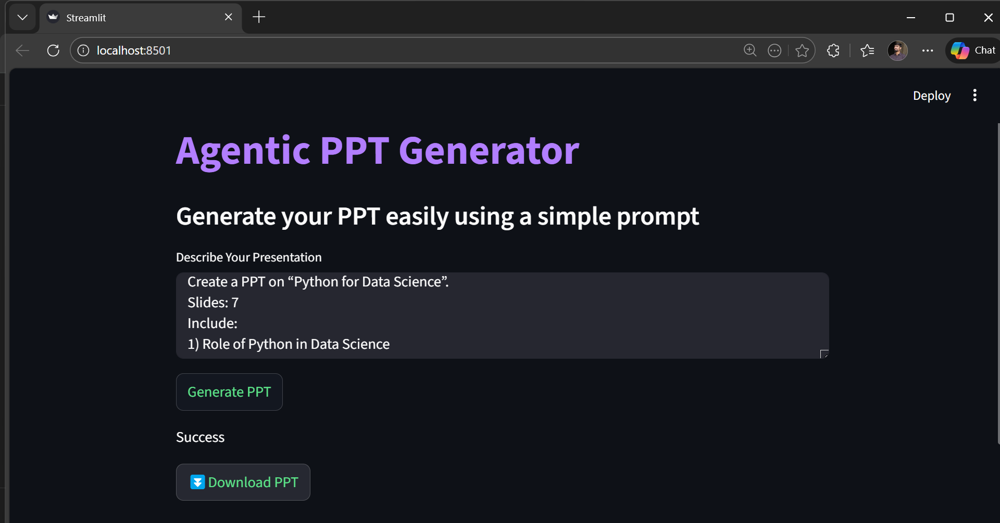
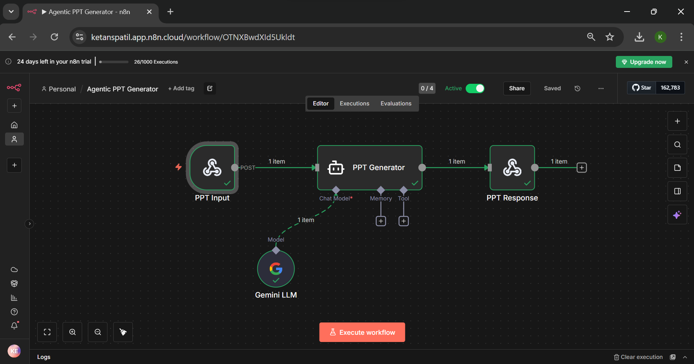

# 📑 Agentic PPT Generator
# Agent-Based PowerPoint Generation with Streamlit & n8n

This is a simple and powerful AI-based PowerPoint generator that creates professional presentations from a single prompt. Users just describe their topic and slide content, and the app takes care of the rest. Built with Streamlit and powered by an n8n AI Agent using Gemini, it automatically generates a ready-to-download .pptx file.

This project allows users to enter PPT details (topic, slide headings, content, etc.) → sends the request to n8n → generates PPT → returns downloadable `.pptx`.

-----

### 🖥️ Application Interface (Streamlit)
 


### ⚙️ Backend Workflow (n8n)
 

---

## 🚀 Features

- Generate **PowerPoint presentations** using natural-language prompts  
- Clean and responsive user interface built with **Streamlit**  
- Backend automation powered by **n8n Webhooks and Gemini AI Agent**  
- Automatically creates well-structured, aligned, and professional slides  
- One-click **Download PPT** functionality  
- Supports any topic and flexible slide structures

---

## 🔁 How It Works

1. The user enters presentation details such as the topic, number of slides, and content.
2. The Streamlit app sends the input to an **n8n Webhook**.
3. The **n8n AI Agent (Gemini)** generates executable `python-pptx` code.
4. Streamlit runs the generated code to create the PowerPoint presentation.
5. The user downloads the final `.pptx` file instantly.

---

## 📁 Project Structure

```
├── app.py                                          # Streamlit frontend application
├── req.txt                                         # Python dependencies
├── agentic_ppt_generator_workflow.json             # n8n workflow export
├── streamlit_interface.png                         # Application UI screenshot
└── n8n_backend_workflow.png                        # n8n backend workflow screenshot
```

---

## ⚙️ Installation

### 1. Install Requirements

```
pip install -r requirements.txt
```

### 2. Run Streamlit App

```
streamlit run app.py
```

### 3. n8n Setup

* Import the **agentic_ppt_generator_workflow.json**
* Add your Gemini/OpenAI API key
* Update the Webhook URL inside `app.py`

---

## 🛠️ Tech Used

* **Streamlit**
* **n8n**
* **AI Agent (Gemini Chat Model)**
* **python-pptx**
* **VS Code**

---
## 🎥 Demo Vedio
[Watch Demo](https://github.com/patilketan03/agentic-ppt-generator/blob/main/agentic_ppt_generator_workflow.mp4)

---
